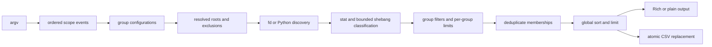

# Engineering record: `file-inventory.py`

- **Date:** 2026-07-31
- **Repository:** `/home/heini/my_repos/UserScripts`
- **Implementation commit:** `e9c3e53c1f2cdb80e0076d70a5d52be49f8deef8`
- **Implementation:** `file-inventory.py`
- **Behavioral tests:** `tests/test_file_inventory.py`

## Status and evidence boundary

This is an educational engineering record. It explains the observable reasoning
behind the implementation: requirements, assumptions, decisions, alternatives,
commands, tests, and remaining limitations.

It is not a verbatim export of private model chain-of-thought. Such a transcript
is neither available here nor necessary to audit the work. The useful substitute
is a concise decision record in which claims can be checked against code, tests,
and repository state.

The command ledger below is reconstructed from the completed task record and
then expressed as reproducible commands. It should not be treated as a
byte-for-byte shell history. Commands rerun while preparing this document are
identified separately.

## Outcome

The repository now contains a standalone Python CLI that inventories regular
files across independently configured target groups. It supports:

- repeated, comma-separated, and space-separated targets;
- wrapper-side expansion of quoted globs;
- local, explicitly global, and inferred trailing option scope;
- finite depth or unlimited recursion without following directory symlinks;
- validated descendant-directory exclusions;
- inclusion and exclusion by suffix, filename pattern, or script type;
- bounded shebang inspection for extensionless scripts;
- inclusive minimum and maximum sizes;
- per-group and global result limits;
- sorting, honest apparent-byte totals, Rich/plain rendering, and CSV output;
- `fd` discovery with a deterministic Python fallback.

The result deliberately does not parse `eza` or `lsd` display output. Discovery
and presentation are separate concerns: `fd` finds candidate paths, while Python
owns metadata, classification, filtering, aggregation, and serialization.

## 1. Converting the request into a model

The difficult part of the request was not walking a directory. It was defining
which options belong to which repeated target clause.

For target group $i$, the implementation can be understood as the tuple

$$
G_i = (T_i, d_i, E_i, I_i, X_i, a_i, b_i, n_i),
$$

where:

- $T_i$ is the ordered set of resolved target roots;
- $d_i$ is the effective traversal depth;
- $E_i$ is the set of excluded descendant directories;
- $I_i$ and $X_i$ are include and exclude selectors;
- $a_i$ and $b_i$ are inclusive minimum and maximum byte bounds;
- $n_i$ is the optional per-group result cap.

The effective depth is defined as

$$
d_i =
\begin{cases}
N, & \text{if a finite depth N is effective for the group},\\
\infty, & \text{if recursion is enabled without a finite depth},\\
1, & \text{otherwise}.
\end{cases}
$$

Thus, depth 1 means direct children, depth 0 means no directory contents, and
`--recursive` without `--depth` means unlimited descent. A direct file target is
still eligible because it does not require descending into a directory.

For each group, discovery and selection are staged:

$$
C_i \xrightarrow{\text{metadata/classification}} M_i
    \xrightarrow{\text{sort}} S_i
    \xrightarrow{\text{take }n_i} P_i,
$$

where $C_i$ is the candidate path set, $M_i$ is the matched-file set, and
$P_i$ is the per-group selected set. The displayed result is

$$
D = \operatorname{take}_{\ell}
    \left(\operatorname{sort}
    \left(\operatorname{dedupe}\left(\bigcup_i P_i\right)\right)\right),
$$

where $\ell$ is the optional global limit. This staging is why totals can
report matched, per-group-selected, and finally displayed bytes without silently
equating a truncated table with the complete match set.

## 2. Reasoning method

### 2.1 Preserve option order before assigning meaning

Ordinary `argparse` destinations flatten repeated options and lose the ordering
needed to answer questions such as “did this `--depth` occur after target group
one or target group two?” Custom actions therefore record an ordered event stream:

- `TargetAction` starts a target clause;
- `ScopedOptionAction` records an option family, value, current group, scope
  mode, and order;
- `ScopeModeAction` changes subsequent scope to local, all targets, or automatic.

Only after parsing does `resolve_group_configs()` assign those events to group
configurations. This is a general parsing lesson: retain syntax first when later
semantics depend on position.

### 2.2 Make ambiguous scope explicit and deterministic

The automatic rule follows the requested shorthand:

1. Options between two target clauses apply to the preceding target group.
2. A target-capable option family used only after the final target broadcasts as
   one trailing bundle.
3. `-n/--number-results` remains local unless `--all-targets` is explicit.
4. `-l/--limit-all` is always global.
5. `--this-target`, `--all-targets`, and `--auto-scope` resolve cases where
   inference would be unclear.

Broadcast values behave as defaults. A local scalar or selector replaces its
broadcast counterpart, while directory exclusions are additive. This avoids a
global default unexpectedly erasing a carefully placed local exclusion.

### 2.3 Treat filesystem containment as an invariant

An exclusion is accepted only if its canonical path is an existing strict
descendant of at least one compatible directory target and is reachable within
that target's finite depth. Canonicalization prevents a symlink that appears to
be inside a root from escaping to an outside directory.

For a root $r$ and proposed exclusion $e$, the essential predicate is

$$
e \neq r \quad\land\quad r \in \operatorname{parents}(e).
$$

Broadcast exclusions are attached only to groups and roots for which this
predicate and the depth constraint hold. A single exclusion therefore need not
be valid for every root in a multi-target group.

### 2.4 Use fast tools only at stable interfaces

`fd` provides a fast, NUL-delimited list of candidate paths. The wrapper then
canonicalizes and post-filters those paths. Root-relative exclusions passed to
`fd` are anchored, preventing an exclusion such as `cache` from accidentally
matching every nested directory named `cache`.

`eza` and `lsd` are excellent presentation tools, but their human-oriented
output is not a stable metadata interchange format. Parsing it would couple
correctness to colors, quoting, locale, terminal width, and version-specific
formatting. Python's `stat`, `csv`, and structured records are safer interfaces.

### 2.5 Classify scripts conservatively

File suffixes are used first. For extensionless files, the script reads at most
4096 bytes from the first line and recognizes direct interpreters as well as
common `/usr/bin/env` and `env -S` forms. This bound prevents classification from
turning into an unbounded content scan.

A suffix selector such as `py` may use a Python shebang as a fallback only for
an extensionless file. A misleading file called `program.txt` with a Python
shebang does not become a `.py` match. The explicit `script` selector is broader
and intentionally selects known script suffixes or any recognized shebang.

### 2.6 Keep discovery, policy, and rendering separate

The main data flow is:



This separation allows the `fd` and Python backends to be tested for behavioral
parity and lets CSV reuse the same selected records shown in the terminal.

## 3. Important decisions and rejected alternatives

| Decision | Reason | Alternative rejected |
|---|---|---|
| Standalone Python CLI | The grammar, filesystem validation, structured records, and CSV error handling exceed what remains clear in a shell wrapper. | A large Bash parser with parallel arrays and positional state. |
| Ordered parse events | Scope depends on occurrence order and option family. | Flattening all values into ordinary `argparse` destinations. |
| `fd` plus Python fallback | Fast when available, portable when absent, and directly testable. | Requiring one non-standard binary. |
| Do not parse `eza`/`lsd` | Their output is for people rather than stable machine interchange. | Treating formatted listings as CSV-like data. |
| Canonical post-filtering | Backend exclusion syntax is an optimization, not the security or correctness boundary. | Trusting an `fd --exclude` pattern as the only containment check. |
| Directory symlinks are not followed | Prevents cycles, root escape, and surprising expansion. | Recursive traversal through symlinked directory graphs. |
| Unique-path totals at multiple stages | A merged file may belong to several roots/groups but should not inflate byte totals. | Summing membership rows or only summing displayed rows. |
| Atomic CSV replacement | A failed serialization should not leave a partially written destination. | Opening the final destination and streaming directly into it. |
| Plain-text fallback | The CLI remains usable when Rich is unavailable or machine-readable stability is preferred. | Making Rich a mandatory dependency. |

## 4. Command ledger

### 4.1 Repository and implementation inspection

These commands represent the inspection method used to understand the existing
repository and verify the resulting implementation:

```bash
pwd
git status --short --branch
rg --files
rg -n "fd|eza|lsd|find|shebang|csv|extension" --glob '*.py' --glob '*.sh'
command -v rg fd fdfind eza lsd
fd --help
eza --help
lsd --help
python file-inventory.py --help
rg -n '^(def|class) |^# -{10,}' file-inventory.py
rg -n '^def test_' tests/test_file_inventory.py
```

The last four inspection commands were rerun while this document was prepared,
together with `git log`, `git show`, and `git remote -v` checks. The earlier
reconnaissance commands are retained as the reproducible search strategy rather
than asserted as a complete historical transcript.

### 4.2 Focused verification

The implementation was checked with the following reproducible commands. Cache
and plugin settings make the checks suitable for restricted or read-only
working environments:

```bash
PYTHONDONTWRITEBYTECODE=1 \
PYTEST_DISABLE_PLUGIN_AUTOLOAD=1 \
python -m pytest -q -p no:cacheprovider tests/test_file_inventory.py

BLACK_CACHE_DIR=/tmp/file-inventory-black-cache \
black --check --workers 1 file-inventory.py tests/test_file_inventory.py

ruff check --isolated --no-cache --line-length 100 --target-version py311 \
  file-inventory.py tests/test_file_inventory.py

mypy --no-incremental --cache-dir /tmp/file-inventory-mypy-cache \
  --no-site-packages --ignore-missing-imports --python-version 3.11 \
  file-inventory.py tests/test_file_inventory.py

PYTHONDONTWRITEBYTECODE=1 python -c \
  'import ast, pathlib; [ast.parse(pathlib.Path(p).read_text(), \
  filename=p, feature_version=(3, 11)) for p in \
  ("file-inventory.py", "tests/test_file_inventory.py")]'
```

Observed result for the implementation commit:

- 26 tests passed;
- Black reported no formatting changes required;
- isolated Ruff reported no violations;
- mypy reported no errors;
- both source files parsed using the Python 3.11 grammar.

The verification pass documented here used Python 3.14.6, `fd` 10.4.2,
Black 26.5.1, Ruff 0.15.17, and mypy 2.1.0. Parsing with
`feature_version=(3, 11)` checks syntax compatibility; it is not a substitute
for executing the suite under a Python 3.11 interpreter.

The repository's normal Ruff configuration contains obsolete rule `W503`, so
the isolated invocation is intentional. Test plugin autoload is disabled because
unrelated globally installed pytest plugins attempted sandbox-incompatible socket
operations. During this document's verification pass, mypy 2.1.0 initially
reported an internal error because it still tried to create `.mypy_cache` in the
read-only canonical checkout despite `--no-incremental`; assigning its cache to
`/tmp` made the same type check pass. That failure concerned the execution
environment, not a source-code type error.

### 4.3 Behavioral smoke checks

Representative commands for manually examining the behavior are:

```bash
# Current directory, direct files only, largest first.
python file-inventory.py --sort size --total-size

# Internally expand a quoted glob and summarize without a per-file table.
python file-inventory.py \
  -t '/usr/local/bin/*' \
  --summary-only --no-rich

# Apply one trailing policy to both target groups.
python file-inventory.py \
  -t "$HOME/repos" \
  -t "$HOME/my_repos" \
  -r -d 4 -x '*.sh,*.py,*.R,*.Rmd,script' \
  --max-size 5MiB -l 150 --sort size --total-size

# Assign distinct local policies and write CSV.
python file-inventory.py \
  -t "$HOME/repos" -d 2 -x sh -e archived -n 30 \
  -t "$HOME/my_repos" -d 6 -x 'py,Rmd' -n 75 \
  --csv inventory.csv
```

### 4.4 Release-state verification

The implementation commit can be checked without trusting this document:

```bash
git show --stat --oneline e9c3e53c1f2cdb80e0076d70a5d52be49f8deef8
git rev-parse HEAD
git rev-parse origin/main
git status --short --branch
```

At the time of implementation, `HEAD` and `origin/main` both resolved to the
commit above. A pre-existing mode-only modification to
`usb-wipe-signatures.sh` was deliberately left unstaged and uncommitted.

## 5. What the tests establish

The focused tests cover:

- trailing broadcast and distinct local target policies;
- explicit `--this-target` and `--all-targets` overrides;
- target glob expansion and deduplication;
- exclusion containment, finite-depth validity, and symlink escape rejection;
- repeated extension events and extensionless shebang classification;
- general patterns, exclusion precedence, and case sensitivity;
- inclusive size bounds, stable sorting, and both limit stages;
- CSV quoting of commas, newlines, Unicode, and non-UTF-8 path bytes;
- overlapping roots with exact membership preservation;
- hidden target behavior and isolated CSV stdout;
- equivalent regular-file discovery from `fd` and Python;
- root-anchored `fd` exclusions and deterministic case-folded ties.

Tests establish behavior for the fixtures they exercise. They do not prove
correct behavior for every filesystem, race, permission model, or future `fd`
version. The implementation therefore retains canonical post-filtering and
reports traversal warnings rather than assuming discovery is infallible.

## 6. Remaining limitations

- CSV replacement is atomic on the destination filesystem, but the code does
  not `fsync` both the file and its parent directory for crash durability.
- Replacing an existing regular CSV preserves its permission bits, but not every
  possible ACL, extended attribute, owner, or group property.
- Directory symlinks are intentionally not traversed.
- Ignore files such as `.gitignore` are deliberately not honored; `--hidden`
  controls hidden entries separately.
- Deduplication uses canonical paths rather than inode identities. Distinct hard
  links to the same inode can therefore appear and contribute apparent bytes
  separately.
- A traversal warning can accompany partial results and a successful exit
  status. Callers requiring proven completeness must treat warnings as a failed
  completeness condition.
- Non-UTF-8 path bytes are represented as escaped Unicode surrogate notation in
  CSV. The CSV remains valid UTF-8, but it is not a lossless raw-byte archive.
- Shebang recognition is pragmatic rather than a complete model of every kernel
  or launcher syntax.
- A file can change between discovery and metadata collection. Such filesystem
  races are handled as skips or warnings where practical, not by snapshotting the
  filesystem.
- The automatic trailing-scope rule is convenient but necessarily unusual.
  Scripts intended for long-term unattended use should prefer explicit
  `--this-target` and `--all-targets` markers.
- Runtime behavior was exercised on Python 3.14.6. The source and configuration
  target Python 3.11 syntax, but the repository does not declare a packaging-level
  `requires-python` constraint and this pass did not execute the suite on 3.11.
- The focused suite does not benchmark large trees or fully exercise Rich layout,
  Windows behavior, or hostile concurrent filesystem mutation.

## 7. Reusable reasoning pattern

For a similar CLI, the transferable method is:

1. Rewrite the request as data structures and invariants before choosing tools.
2. Preserve source ordering if meaning depends on position.
3. Separate discovery from filtering and presentation.
4. Define path containment canonically rather than lexically.
5. State whether bounds are inclusive and when limits are applied.
6. Retain pre-limit data if the output reports totals.
7. Make ambiguous shorthand overridable with explicit syntax.
8. Test equivalence when two execution backends implement the same contract.
9. Treat formatted CLI output as unstable unless the producer promises a
   machine-readable schema.
10. Record assumptions, commands, failures, and residual risks at handoff.

For future work, a useful export request is:

> Create a Markdown engineering record containing the goal, constraints,
> verified facts, assumptions, decision points, rejected alternatives, commands
> with working directories and outcomes, tests, limitations, and exact artifact
> paths. Exclude secrets and private chain-of-thought; provide an auditable
> reasoning summary instead.

That format preserves the educational and reproducibility value of the work
without pretending that an unfiltered internal monologue is a reliable technical
artifact.
