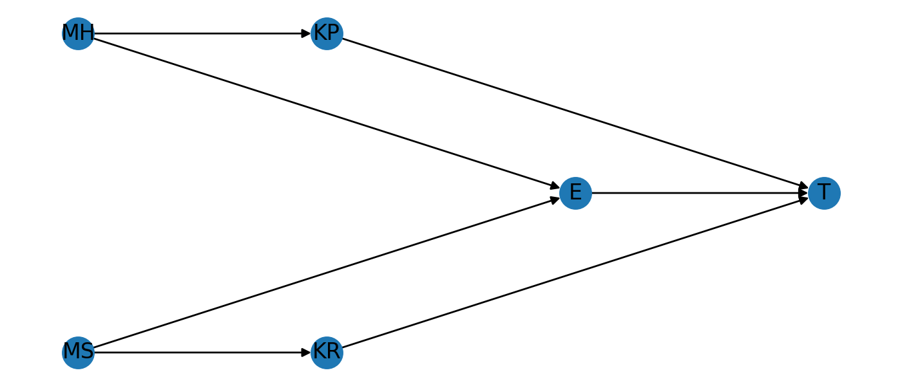

```{r setup, include=FALSE}
knitr::opts_chunk$set(
  echo = TRUE,
  message = FALSE,
  warning = FALSE
)

# If you want to force a specific Python:
# Sys.setenv(RETICULATE_PYTHON = "/usr/bin/python3")

library(reticulate)

# Optional: explicitly select python3 if present (non-fatal if not found)
py3 <- Sys.which("python3")
if (nzchar(py3)) {
  reticulate::use_python(py3, required = FALSE)
}

# Verify / print active Python (useful for debugging)
reticulate::py_config()
```

# Goal

Generate a NetworkX DAG figure **from a Python chunk** and (optionally) render it
in the knitted HTML. The PNG will be written to the same directory as the `.Rmd`
during knitting (unless you change the knit working directory).

# Python code (NetworkX + Matplotlib)

```{python}
import matplotlib.pyplot as plt
import networkx as nx

G = nx.DiGraph()
nodes = ["MH","MS","KP","KR","E","T"]
G.add_nodes_from(nodes)

edges = [
  ("MH","KP"), ("MS","KR"),
  ("KP","T"), ("KR","T"),
  ("MH","E"), ("MS","E"),
  ("E","T")
]
G.add_edges_from(edges)

pos = {
  "MH": (0, 1), "MS": (0, 0),
  "KP": (1, 1), "KR": (1, 0),
  "E":  (2, 0.5),
  "T":  (3, 0.5)
}

plt.figure(figsize=(7, 3))
nx.draw(G, pos, with_labels=True, arrows=True)
plt.tight_layout()

# Save to a file next to the knitted output
plt.savefig("dag_python.png", dpi=200)

# Also show inline in the knitted document (HTML/PDF)
plt.show()
```

# Include the saved PNG (optional)

```{r include_png}

```

# Notes

- Required R package: `reticulate`.
- Required Python packages: `networkx`, `matplotlib`.
- If your knitting Python environment lacks these, install them into the Python
  that reticulate is using (check `py_config()` output), e.g.:

  - System Python (Arch):
    - `sudo pacman -S python-networkx python-matplotlib`
  - pip (venv/conda):
    - `pip install networkx matplotlib`
